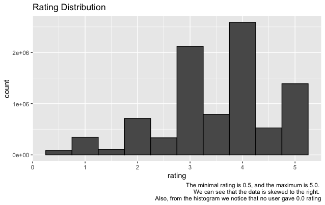
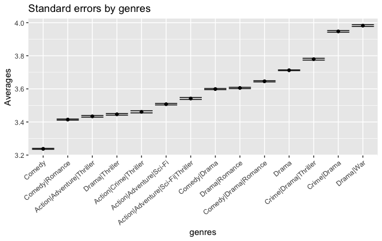
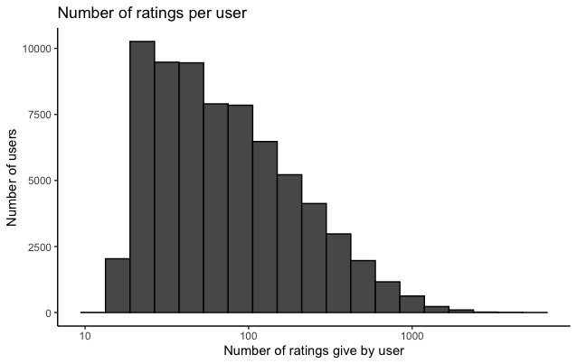
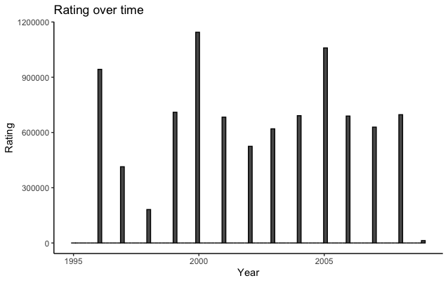

<h1 align="center">Movielense</h1>

# Content 

1. [Introduction](#intr)
2. [Aims and Objectives](#aim)
3. [Data Download](#data)
4. [Data Visualisation](#visual)
5. [Methods](#methods)
6. [Linear Model](#linear)
7. [Regularisation](#reg)
8. [Matrix Factorisation](#matrix)
9. [Results](#res)
10. [Conclusion](#conc)
11. [References](#ref)

<a name="intr"></a>

# Introduction 

Recommendation systems are an essential part of the machine learning algorithms and help offer users suggestions according to their preferences and selection of movies/products. Companies such as LinkedIn, Amazon, Netflix, etc., are using recommender systems to satisfy and ease their customers' search. 
In this project, we will look at the Netflix Prize open competition introduced on the 2nd of October 2006. The competition aimed to provide the best collaborative filtering algorithm to predict the user rating to the film based on the previous ratings using limited information. By June 2007, over 20 000 teams had registered for the competition, and in September 2009, the team called  "BellKor's Pragmatic Chaos" won the prize and achieved RMSE = 0.8567. The grand prize was US$1,000,000. 

<a name="aim"></a>

# Aims and Objectives
The aim of the project is to train different linear models to achieve the most accurate RMSE result using the provided training set (edx) and test set (validation). 

## Objectives: 

1. Explore the data; 
2. Look for the correlation between different parameters;
3. Preprocess the data by removing any NAs and zero variance parameters; 
4. Train different linear models and compare the RMSE results.

<a name="data"></a>

# Data Download

```
if(!require(tidyverse)) install.packages("tidyverse", repos = "http://cran.us.r-project.org")
if(!require(caret)) install.packages("caret", repos = "http://cran.us.r-project.org")
if(!require(data.table)) install.packages("data.table", repos = "http://cran.us.r-project.org")

library(tidyverse)
library(caret)
library(data.table)

# MovieLens 10M dataset:
# https://grouplens.org/datasets/movielens/10m/
# http://files.grouplens.org/datasets/movielens/ml-10m.zip

dl <- tempfile()
download.file("http://files.grouplens.org/datasets/movielens/ml-10m.zip", dl)

ratings <- fread(text = gsub("::", "\t", readLines(unzip(dl, "ml-10M100K/ratings.dat"))),
                 col.names = c("userId", "movieId", "rating", "timestamp"))

movies <- str_split_fixed(readLines(unzip(dl, "ml-10M100K/movies.dat")), "\\::", 3)
colnames(movies) <- c("movieId", "title", "genres")

# if using R 4.0 or later:
movies <- as.data.frame(movies) %>% mutate(movieId = as.numeric(movieId),
                                           title = as.character(title),
                                           genres = as.character(genres))


movielens <- left_join(ratings, movies, by = "movieId")
# Validation set will be 10% of MovieLens data
set.seed(1) 
test_index <- createDataPartition(y = movielens$rating, times = 1, p = 0.1,
                                  list = FALSE)
edx <- movielens[-test_index,]
temp <- movielens[test_index,]

# Make sure userId and movieId in validation set are also in edx set
validation <- temp %>% 
  semi_join(edx, by = "movieId") %>%
  semi_join(edx, by = "userId")

# Add rows removed from validation set back into edx set
removed <- anti_join(temp, validation)
edx <- rbind(edx, removed)
rm(dl, ratings, movies, test_index, temp, movielens, removed)

```

<a name="visual"></a>

# Data Visualisation

| userId               |  movieId      | rating        | timestamp         | title            | genres           |
| -------------------- | ------------- | ------------- | ----------------- | ---------------- | ---------------- |
| Min.   :    1        | Min.   :    1 | Min.   :0.500 | Min.   :7.897e+08 | Length:9000055   | Length:9000055 
| 1st Qu.:18124        | 1st Qu.:  648 | 1st Qu.:3.000 | 1st Qu.:9.468e+08 | Class :character | Class :character |
| Median :35738        | Median : 1834 | Median :4.000 | Median :1.035e+09 | Mode  :character | Mode  :character | 
| Mean   :35870        | Mean   : 4122 | Mean   :3.512 | Mean   :1.033e+09 |
| 3rd Qu.:53607        | 3rd Qu.: 3626 | 3rd Qu.:4.000 | 3rd Qu.:1.127e+09 |
| Max.   :71567        | Max.   :65133 | Max.   :5.000 | Max.   :1.231e+09 |

We can see that there are 71567 userIds and 65133 movieIds,however, we should define the nuber of unique userIds and movieIds
| userId | movieId |
| ------ | ------- |
| 69878  | 10677   |

The minimal rating is 0.5, and the maximum is 5.0. 



It is obvious that some people preferred one movie genre to another, therefore, it is worth to investigate the effect of the genre on the movie rating. We will look at top 20 genres in the data set. We can see that the top genre is Drama followed by Comedy and Action. 



As we established there are 10677 movies in the data set and using the logic we can say that some movies are rated watched more than others and therefore are rated more frequently. Whereas, others can be rated only few times. We can see that some movies were rated only one time, and some were rated for 
more than 10'000 time.


As we defined previously there is 69878 and we can check the number of ratings given by them. We can see that some users have rated less than 30 movies, and this will underestimate our models.



We also know that more recent movies are tend to be rated more frequently than older ones. Therefore we can convert the timestamp column of the edx data set 
into a date of the rating was given. Afterwards, we will be able to explore the relationship of the date and rating. Looking at the graph can suggest some relationship between the time and the rating, however, there is no strong correlation. 



<a name="methods"></a>

