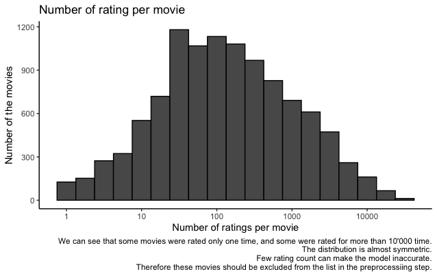

<h1 align="center">Movielense</h1>

# Content 

1. [Introduction](#intr)
2. [Aims and Objectives](#aim)
3. [Data Download](#data)
4. [Data Visualisation](#visual)
5. [Methods](#methods)
6. [Linear Model](#linear)
7. [Regularisation](#reg)
8. [Matrix Factorisation](#matrix)
9. [Results](#res)
10. [Conclusion](#conc)
11. [References](#ref)

<a name="intr"></a>

# Introduction 

Recommendation systems are an essential part of the machine learning algorithms and help offer users suggestions according to their preferences and selection of movies/products. Companies such as LinkedIn, Amazon, Netflix, etc., are using recommender systems to satisfy and ease their customers' search. 
In this project, we will look at the Netflix Prize open competition introduced on the 2nd of October 2006. The competition aimed to provide the best collaborative filtering algorithm to predict the user rating to the film based on the previous ratings using limited information. By June 2007, over 20 000 teams had registered for the competition, and in September 2009, the team called  "BellKor's Pragmatic Chaos" won the prize and achieved RMSE = 0.8567. The grand prize was US$1,000,000. 

<a name="aim"></a>

# Aims and Objectives
The aim of the project is to train different linear models to achieve the most accurate RMSE result using the provided training set (edx) and test set (validation). 

## Objectives: 

1. Explore the data; 
2. Look for the correlation between different parameters;
3. Preprocess the data by removing any NAs and zero variance parameters; 
4. Train different linear models and compare the RMSE results.

<a name="data"></a>

# Data Download

```
if(!require(tidyverse)) install.packages("tidyverse", repos = "http://cran.us.r-project.org")
if(!require(caret)) install.packages("caret", repos = "http://cran.us.r-project.org")
if(!require(data.table)) install.packages("data.table", repos = "http://cran.us.r-project.org")

library(tidyverse)
library(caret)
library(data.table)

# MovieLens 10M dataset:
# https://grouplens.org/datasets/movielens/10m/
# http://files.grouplens.org/datasets/movielens/ml-10m.zip

dl <- tempfile()
download.file("http://files.grouplens.org/datasets/movielens/ml-10m.zip", dl)

ratings <- fread(text = gsub("::", "\t", readLines(unzip(dl, "ml-10M100K/ratings.dat"))),
                 col.names = c("userId", "movieId", "rating", "timestamp"))

movies <- str_split_fixed(readLines(unzip(dl, "ml-10M100K/movies.dat")), "\\::", 3)
colnames(movies) <- c("movieId", "title", "genres")

# if using R 4.0 or later:
movies <- as.data.frame(movies) %>% mutate(movieId = as.numeric(movieId),
                                           title = as.character(title),
                                           genres = as.character(genres))


movielens <- left_join(ratings, movies, by = "movieId")
# Validation set will be 10% of MovieLens data
set.seed(1) 
test_index <- createDataPartition(y = movielens$rating, times = 1, p = 0.1,
                                  list = FALSE)
edx <- movielens[-test_index,]
temp <- movielens[test_index,]

# Make sure userId and movieId in validation set are also in edx set
validation <- temp %>% 
  semi_join(edx, by = "movieId") %>%
  semi_join(edx, by = "userId")

# Add rows removed from validation set back into edx set
removed <- anti_join(temp, validation)
edx <- rbind(edx, removed)
rm(dl, ratings, movies, test_index, temp, movielens, removed)

```

<a name="visual"></a>

# Data Visualisation

| userId               |  movieId      | rating        | timestamp         | title            | genres           |
| -------------------- | ------------- | ------------- | ----------------- | ---------------- | ---------------- |
| Min.   :    1        | Min.   :    1 | Min.   :0.500 | Min.   :7.897e+08 | Length:9000055   | Length:9000055 
| 1st Qu.:18124        | 1st Qu.:  648 | 1st Qu.:3.000 | 1st Qu.:9.468e+08 | Class :character | Class :character |
| Median :35738        | Median : 1834 | Median :4.000 | Median :1.035e+09 | Mode  :character | Mode  :character | 
| Mean   :35870        | Mean   : 4122 | Mean   :3.512 | Mean   :1.033e+09 |
| 3rd Qu.:53607        | 3rd Qu.: 3626 | 3rd Qu.:4.000 | 3rd Qu.:1.127e+09 |
| Max.   :71567        | Max.   :65133 | Max.   :5.000 | Max.   :1.231e+09 |

We can see that there are 71567 userIds and 65133 movieIds,however, we should define the nuber of unique userIds and movieIds
| userId | movieId |
| ------ | ------- |
| 69878  | 10677   |

The minimal rating is 0.5, and the maximum is 5.0. 


It is obvious that some people preferred one movie genre to another, therefore, it is worth to investigate the effect of the genre on the movie rating. We will look at top 20 genres in the data set. We can see that the top genre is Drama followed by Comedy and Action. 


As we established there are 10677 movies in the data set and using the logic we can say that some movies are rated watched more than others and therefore are rated more frequently. Whereas, others can be rated only few times. We can see that some movies were rated only one time, and some were rated for 
more than 10'000 time.



As we defined previously there is 69878 and we can check the number of ratings given by them. We can see that some users have rated less than 30 movies, and this will underestimate our models.


We also know that more recent movies are tend to be rated more frequently than older ones. Therefore we can convert the timestamp column of the edx data set 
into a date of the rating was given. Afterwards, we will be able to explore the relationship of the date and rating. Looking at the graph can suggest some relationship between the time and the rating, however, there is no strong correlation. 


<a name="methods"></a>

# Methods

<a name="linear"></a>

## Linear Model 

The start model assumes the same prediction for all users and movies, explaining difference by random variation. Here  represents the "true" rating for all movies.  is an independent errors sampled from the same distribution, that is centered at zero. The first equation to use will be: 


The  is the predicted rating. Any additional value will increase the  root mean squared error (RMSE).


Therefore, we will add an additional variable  that represents the average ranking for the movie i, improving our RMSE model: 


Knowing that some users ranked more movies than other users brings in place another bias, user-specific effect. We will call this variable , and therefore, increase the RMSE: 

From the data exploration we defined that there is some effect of the time on the rating, therefore we can imply time-specific effect to the RMSE model. However, the correlation was not significant and may cause in decrease of the RMSE, so we would not use time-specific effect in our analysis. 

<a name="reg"></a>

## Regularisation 
The linear model  will provide a good estimation of ratings, however it will not penalize large estimates that come from small samples. For example, movies that were rated few times or users that gave ratings for very few movies. Not accounting this will lead to the large estimated errors. 
Therefore, the estimated value will be improved by applying the penalty term. The b's estimate now will be: 


The  is the mean square error, and the  is a penalty term. Note that when b is getting large the penalty term increases. Now we can calculate the movie-specific and the user-specific effects using regularization: 

1. 
2. 

Here  is a tuning parameter and we can use cross-validation to choose the minimum one that gives the most accurate RMSE.

<a name="matrix"></a>

## Matrix Factorisation 

Data can be converted into matrix to study the same rating patterns in the movies and users groups. Each user gets a row and each movie gets a column. The aim is to approximate the large matrix  into two smaller vectors  and , such that : .  is the u-th row of P, and  is the v-th row of Q. Therefore, the the rating given by the user  for the movie  is .This allows us to apply more variance in the original RMSE model: 


We can use Singular value composition (SVD) that finds the vectors p and q that permit us to write the matrix of residuals r with m rows and n columns. By using principal components analysis (PCA), matrix factorization can capture structure in the data determined by user opinions about movies. 
For Matrix Factorisation we will user the Recosystem package. 

<a name="res"></a>

# Results

| Method                                                |  RMSE         | 
| ------------------------------------------------------| ------------- | 
| Goal RMSE                                             | 0.8649000     | 
| Monte Carlo simulation                                | 1.4998974     |
| Just the average                                      | 1.0603313     | 
| Movie Effect Model                                    | 0.9439087     | 
| Movie + User Effect Model                             | 0.8653488     | 
| Regularised Movie + User Effect Model                 | 0.8648170     | 
| Matrix Factorisation	                                | 0.7823751     |

<a name="conc"></a>

# Conclusion

Using the training set and validation set we have successfully trained several linear regression models, which we studied in the previous courses of the HarvardX Data Science programme. We identified that the linear regression model using regularised user and movie effect model and matrix factorisation gave the desired result of the RMSE < 0.8649000. The matrix factorisation produced the RMSE = 0.7823751, and we achieved this using the recosystem package and model from the (https://www.kdnuggets.com/2019/09/machine-learning-recommender-systems.html). 

<a name="ref"></a>

# References

1. Irizarry, R. (2021). Introduction to Data Science. Retrieved 25 October 2021, from https://rafalab.github.io/dsbook/
2. Netflix Prize - Wikipedia. (2021). Retrieved 25 October 2021, from https://en.wikipedia.org/wiki/Netflix_Prize
3. Qiu, Y. (2021). recosystem: Recommender System Using Parallel Matrix Factorization. Retrieved 25 October 2021, from https://cran.r-project.org/web/packages/recosystem/vignettes/introduction.html
4. Seif, G. (2021). An Easy Introduction to Machine Learning Recommender Systems - KDnuggets. Retrieved 25 October 2021, from https://www.kdnuggets.com/2019/09/machine-learning-recommender-systems.html
